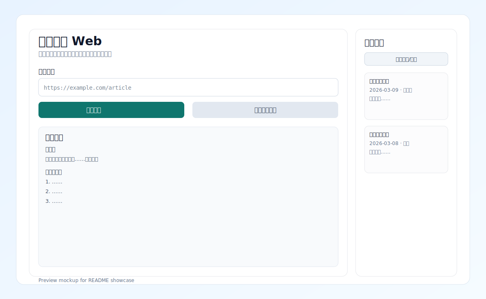
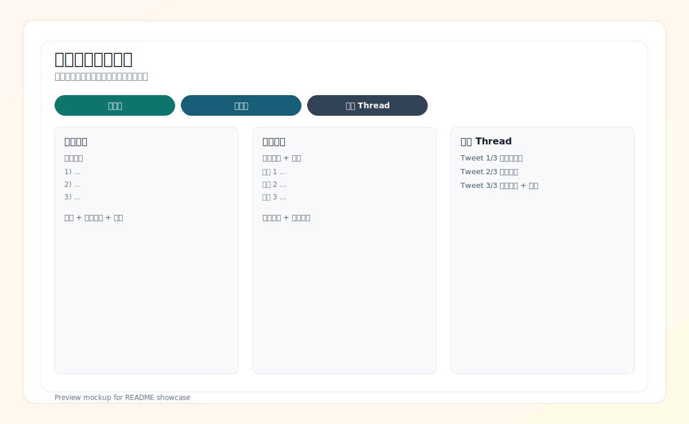

# AI URL Summarizer

[](https://github.com/Furfurdo/ai-url-summarizer-cli/actions/workflows/ci.yml)
[](https://www.python.org/)
[](LICENSE)

输入一篇网页链接，快速得到可用结果：

- 摘要
- 关键观点
- 关键词
- 观点证据片段
- 发布渠道草稿（小红书 / 公众号 / 推文 Thread）

支持任意 OpenAI 兼容接口：OpenAI、Gemini 兼容网关、OpenRouter、OneAPI 等。

## 功能亮点

| 模块 | 能力 |
|---|---|
| CLI 交互菜单 | 无参数运行即进入菜单，适合新手 |
| 单篇总结 | 输入 URL，输出摘要/观点/关键词 |
| 批量总结 | 支持 `.txt` / `.csv` URL 文件 |
| 网页端 | 轻界面输入、历史记录、复制按钮 |
| 发布渠道适配 | 生成小红书/公众号/推文文案结构 |
| 可追溯性 | 每条关键观点附证据片段 |

## 产品演示

### Web 主页（输入与历史）



### 渠道文案（多平台适配）



## 30 秒上手（Windows）

1. 安装依赖

```bash
pip install -r requirements.txt
```

2. 首次配置（推荐双击）

- 双击 [setup.bat](setup.bat)
- 依次填写 `API Key`、`LLM_MODEL`、`LLM_BASE_URL`

3. 运行方式（任选一种）

- 双击 [start.bat](start.bat)：进入交互菜单
- 双击 [summarize.bat](summarize.bat)：单篇 URL
- 双击 [batch.bat](batch.bat)：批量文件
- 双击 [web.bat](web.bat)：网页端（`http://127.0.0.1:7860`）

## 配置说明

配置文件模板见 [.env.example](.env.example)。

常见示例：

```env
# OpenAI 官方
LLM_API_KEY=your_key
LLM_MODEL=gpt-4o-mini
LLM_BASE_URL=https://api.openai.com/v1
```

```env
# Gemini OpenAI 兼容地址
LLM_API_KEY=your_key
LLM_MODEL=gemini-2.5-flash
LLM_BASE_URL=https://generativelanguage.googleapis.com/v1beta/openai
```

## 网页端体验

网页端提供：

1. 链接输入 + 前端校验
2. 输入快捷操作（示例链接 / 清空链接）
3. 历史记录（最多 30 条，带摘要预览）
4. 一键复制摘要 / Markdown / 渠道文案
5. 历史导出 Markdown
6. 清空历史（二次确认）

## 发布渠道适配

- `none`: 不生成渠道文案
- `xiaohongshu`: 标题备选 + 开场 + 正文要点 + 标签
- `wechat`: 标题建议 + 导语 + 正文框架 + 结尾
- `tweet`: 3 条 Thread 草稿

## CLI 用法

```bash
# 进入交互菜单
python src/cli.py

# 单篇总结
python src/cli.py summarize "https://example.com/article" --template study --channel xiaohongshu

# 批量总结
python src/cli.py batch examples/urls.txt --template research --format markdown --output outputs/batch.md

# 网页端
python src/cli.py web --host 127.0.0.1 --port 7860
```

## 批量文件格式

- 文本示例：[examples/urls.txt](examples/urls.txt)
- CSV 示例：[examples/urls_template.csv](examples/urls_template.csv)

CSV 默认优先读取 `url` 或 `link` 列。

## 开发与质量

```bash
# 测试
python -m unittest discover -s tests -v

# 代码规范（需要先安装 ruff）
python -m pip install ruff
python -m ruff check src tests
```

## 版本发布

本项目支持自动发布流程：

1. `main` 分支通过 CI
2. 推送语义化标签（如 `v1.0.0`）
3. 自动执行 `Release` 工作流并创建 GitHub Release

发布说明见：[docs/RELEASE.md](docs/RELEASE.md)

## 路线图

- 产品路线图：[docs/ROADMAP.md](docs/ROADMAP.md)
- Roadmap 条目模板：`Issues -> New Issue -> Roadmap Item`

## 常见问题

### 未检测到 API Key

```bash
python src/cli.py setup
```

### 网页端提示连接失败

按顺序检查：

1. `LLM_BASE_URL` 是否正确
2. 当前网络能否访问该地址
3. `LLM_MODEL` 是否是平台支持模型名
4. API Key 是否有效且有额度

## 项目结构

```text
src/
  cli.py
  content_extractor.py
  summarizer.py
  publish_adapter.py
  web_app.py
tests/
docs/
examples/
setup.bat
start.bat
summarize.bat
batch.bat
web.bat
```

更新记录见 [CHANGELOG.md](CHANGELOG.md)。

## 协作与反馈

- 贡献指南：[CONTRIBUTING.md](CONTRIBUTING.md)
- 安全说明：[SECURITY.md](SECURITY.md)
- 问题反馈：GitHub Issues（已提供 Bug/Feature/Roadmap 模板）

## License

[MIT](LICENSE)
